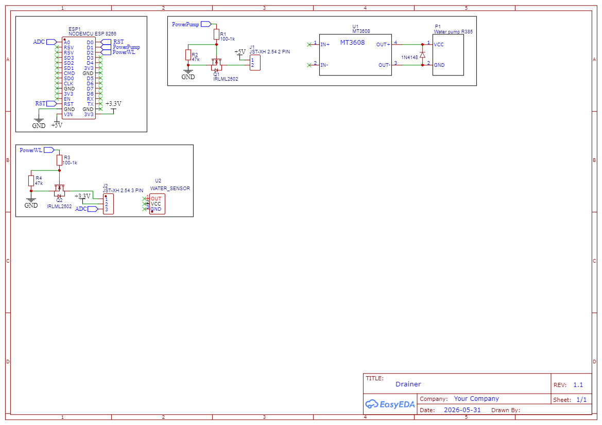

# Automatically maintains a stable water level in a container using a water level sensor.

### Hardware:
- Esp8266 nodemcu v3
- 3pin water level sensor (red)
- MT3608 DC-DC step up converter
- R385 Suction pump
- 2x IRLML2502 (DC-DC -> Pump power supply)
- Some resistors

> **This project uses a 5V 2A USB power supply from a standard USB charger.**

### Scheme
